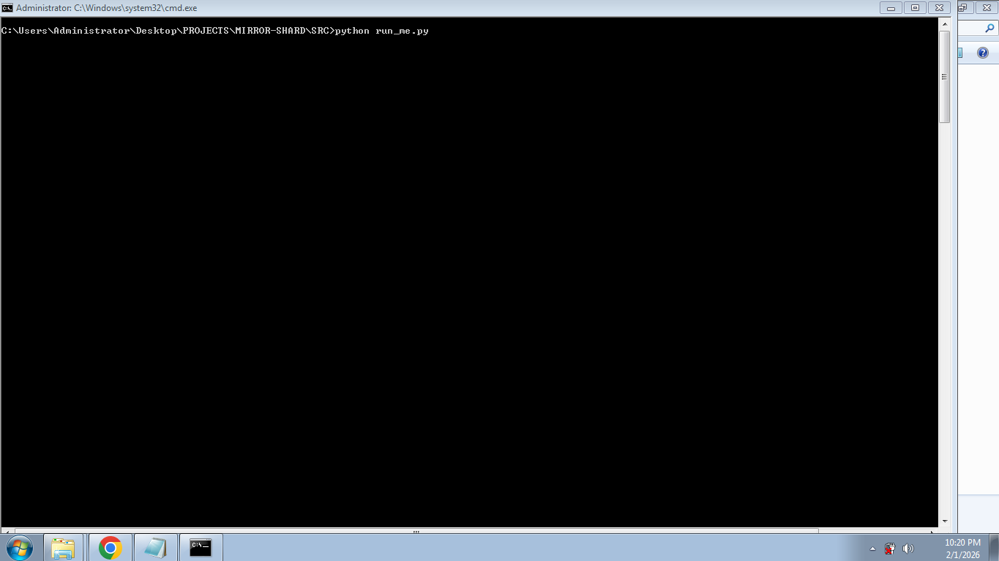
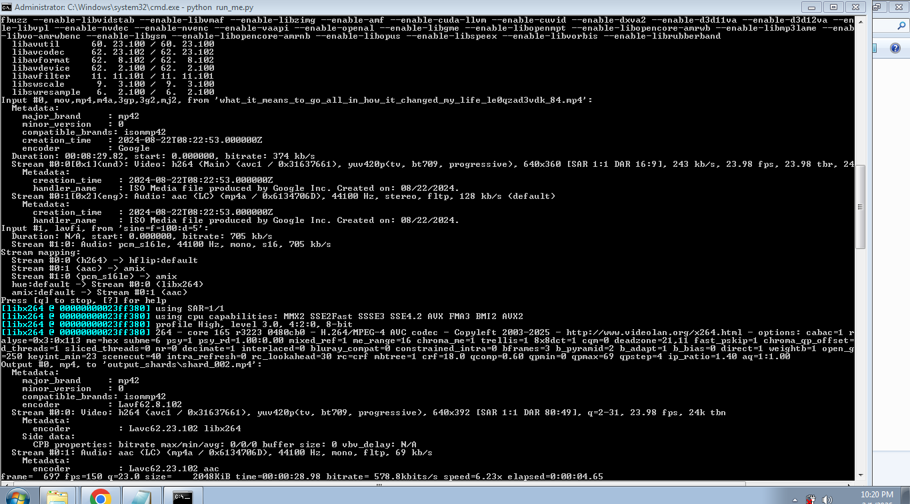
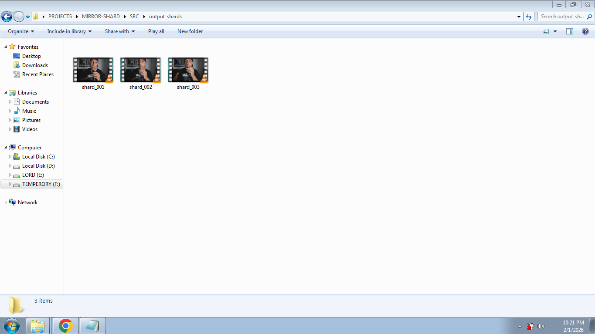

# CHRONOS_RIPPER
This script, CHRONOS_RIPPER, is a specialized video mutation engine. It shatters monolithic files into randomized, 60-second "shards" designed to bypass automated detection. Using FFmpeg, it applies high-speed transformations—horizontal flips, dynamic scaling, hue shifts, and audio masking—to ensure every output is a unique digital asset.

## *chronos_ripper*: The Digital Mutation Engine**

This isn't a "utility." It’s a shredder for the surveillance age. **SHARD_STORM** takes monolithic video files and shatters them into mutated, unique digital fragments. Each shard is algorithmically altered—flipped, scaled, and frequency-masked—to ensure no two outputs share the same fingerprint.

---

### **Capabilities**

* **Recursive Sharding:** Automatically carves long-form media into ~60s segments.
* **Visual Mutation:** Employs horizontal flipping, 1.2x zoom-cropping, and hue rotation to break pixel-matching.
* **Acoustic Masking:** Layers a low-frequency sine-wave mask to disrupt audio fingerprinting.
* **Randomized Inception:** Offsets start times to prevent sequence recognition.

---

### **Deployment Instructions**

1. **Prepare the Payload:** Drop your target video files (`.mp4`, `.mkv`, `.avi`, or `.mov`) into the **same folder** as `run_me.py`.
2. **Initialize the Environment:** Ensure `FFmpeg` is installed and added to your system PATH.
3. **Execute the Engine:**
* Navigate to the folder in File Explorer.
* Hold **Shift + Right Click** (or left-click on some Windows builds) on the empty space.
* Select **"Open PowerShell window here"** or **"Open command window here"**.
* Type the following and hit Enter:
`python run_me.py`

4. **Harvest:** Collect your mutated assets from the `output_shards` directory.

---

### **A Warning for the Mediocre**

This script overwrites existing shards in the output folder without hesitation. It assumes you know what you are doing. If you lose data, it's because you weren't paying attention.

 
 

